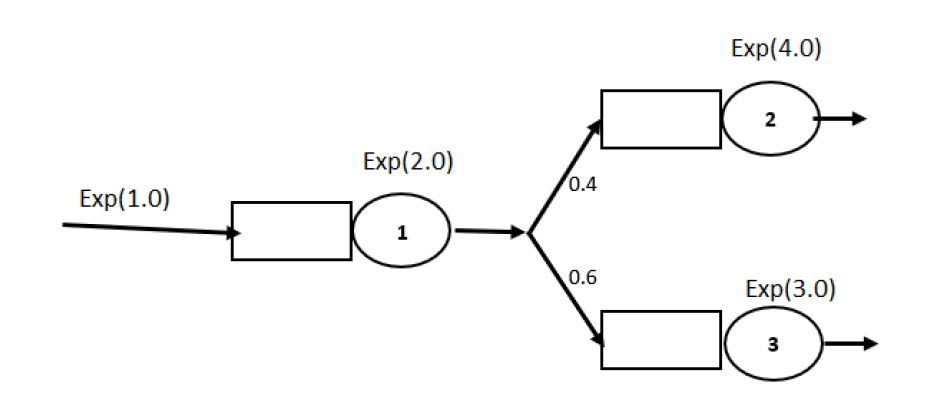

# QueueSimulation 

In this project, the following open queuing network is implemented, and it also calculates the performance criteria after the model reaches a stable state.
This network consists of three queues, the time distribution between entering the first queue and the service time of all queues is exponential.

</img> 

## Document 
The report is written in Persian.(will be translated soon!!)

[View the report for more information ](Doc-MobinaKashaniyan-HW1.pdf)

## Language
The project is written in Java.

## Images
</img> 
</img> 

## Contributing
Pull requests are welcome. For major changes, please open an issue first to discuss what you would like to change.

Please make sure to update tests as appropriate.

## License
[ Apache-2.0 License](http://www.apache.org/licenses/)
